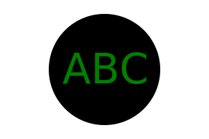

# <Your-Project-Title>SVG Logo Maker

## Description [](https://opensource.org/licenses/MIT)

- What was your motivation?

      To generate a simple svg logo to save designer fee.

- Why did you build this project?

      To save money on design.

- What problem does it solve?

      Save some money and also make it easy to generate basic SVG logo.

- What did you learn?

      Create SVG file with text lines, jest tests, class constructor.

## Table of Contents

- [Installation](#installation)
- [Usage](#usage)
- [Credits](#credits)
- [License](#license-and-badges)
- [Additional Info](#additional-infomation)

## Installation

Run in integrated terminal with

```bash
node index.js
```

## Usage

Follow the questions.

1.  Pick a shape from list (Circle, Triangle or Square),

2.  Enter 0 - 3 your desired characters,

3.  Enter color for the text, you can use red, green, orange color keywords or a hexadecimal number with #,

    Example red will output red text, yellow will output yellow text, #CD5C5C will output IndianRed, #FF00FF will output Fuchsia

4.  Enter color for the shape, above rules applied.

Then it will generate a svg file with width of 300 and height of 200

Example is a Circle shape, with ABC text, with green text and black shape color



## Credits

Example from course, mdn web docs, and Wayne

## License-and-Badges

[](https://opensource.org/licenses/MIT)

---

## Features

SVG Logo maker

## Tests

jest test

run the test in integrated terminal with

```bash
npm test
```

It will test the content of Circle, Triangle and Square, and the shape's color

## Additional-Infomation

Github: https://github.com/wayne80361

Email: wayne80361@gmail.com

REPO LINK:
https://github.com/wayne80361/SVG-Logo-Maker-Wayne

Video Link:
https://drive.google.com/file/d/17RL-2usErwDmDEACa2BzDqKrJLHXJBHe/view
